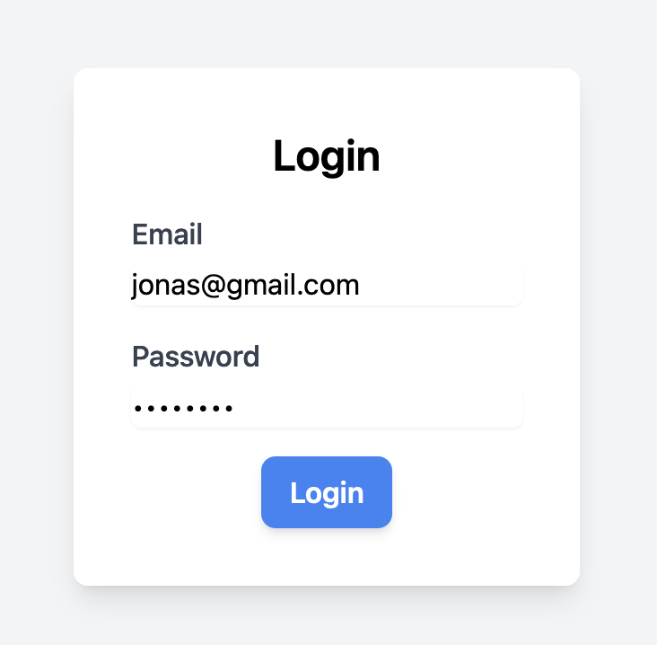

# vue dash

### Front-end Stack
1. Tailwindcss
2. Vue
3. Typescript

### Login Page

1. Giriş için apiye istek atılır
2. Karışılığında JWT Token alınır
3. Cookie'ye kaydedilir.
4. Her route değişiminde interceptor aracılığıyla login olup olmadığı, jwt'nin geçerli olup olmadığı kontrol edilir.

### Flowbite Entegrasyonu

1. Hazır Bileşenler kullanılabilir.
2. Güncel componentlara ulaşın: [Click me 🚀](https://flowbite.com/) 

REST API LINK: 
[Click me 🚀 ](https://github.com/OmerAtayilmaz/php-restfull-api)